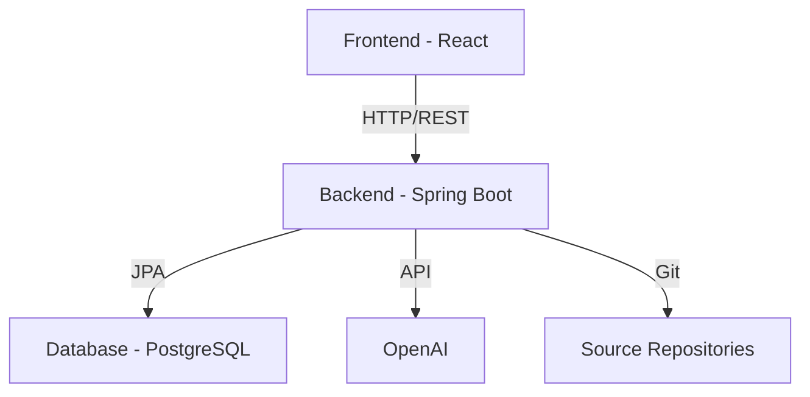

# TestSage Architecture Documentation

## System Architecture

TestSage follows a microservices-based architecture with the following main components:

### Frontend (React Application)
- Single-page application built with React
- Communicates with backend via REST APIs
- Handles user interface and interactions
- Uses React Query for state management
- Containerized using Nginx

### Backend (Spring Boot Application)
- REST API service built with Spring Boot
- Handles business logic and data persistence
- Integrates with OpenAI for AI capabilities
- Uses JPA for database operations
- Containerized using JDK 17

### Database (PostgreSQL)
- Stores application data
- Handles repository metadata
- Manages risk configurations
- Persists analysis results

### External Services
- OpenAI API for code analysis and test generation
- Git repositories for code access

## Component Diagram


## Data Flow

1. **Repository Analysis Flow**
   ```mermaid
   sequenceDiagram
       participant User
       participant Frontend
       participant Backend
       participant Git
       participant OpenAI
       participant DB

       User->>Frontend: Request Analysis
       Frontend->>Backend: POST /api/analyze
       Backend->>Git: Clone/Pull Repository
       Backend->>OpenAI: Analyze Code
       Backend->>DB: Store Results
       Backend->>Frontend: Return Analysis ID
       Frontend->>Backend: Poll Status
       Backend->>Frontend: Return Results
       Frontend->>User: Display Results
   ```

2. **Test Generation Flow**
   ```mermaid
   sequenceDiagram
       participant User
       participant Frontend
       participant Backend
       participant OpenAI
       participant DB

       User->>Frontend: Request Test Generation
       Frontend->>Backend: POST /api/generate-tests
       Backend->>DB: Get Risk Areas
       Backend->>OpenAI: Generate Tests
       Backend->>DB: Store Tests
       Backend->>Frontend: Return Results
       Frontend->>User: Display Tests
   ```

## Security Architecture

- Spring Security for authentication and authorization
- CORS configuration for frontend access
- Environment variables for sensitive configuration
- Docker secrets for production deployments

## Deployment Architecture

### Development Environment
- Local Docker Compose setup
- Hot-reload enabled for frontend
- Debug mode for backend
- Local PostgreSQL instance

### Production Environment
- Kubernetes deployment recommended
- Load balancer for frontend
- Multiple backend instances
- Managed PostgreSQL service
- Monitoring and logging setup

## Performance Considerations

1. **Database Optimization**
   - Indexed queries for repository lookups
   - Pagination for large result sets
   - Connection pooling with HikariCP

2. **API Performance**
   - Response caching where appropriate
   - Asynchronous operations for long-running tasks
   - Batch processing for bulk operations

3. **Frontend Performance**
   - Code splitting and lazy loading
   - Static asset optimization
   - Client-side caching

## Monitoring and Logging

1. **Application Metrics**
   - Request/response times
   - Error rates
   - API usage statistics
   - Database performance

2. **System Metrics**
   - CPU usage
   - Memory consumption
   - Disk I/O
   - Network traffic

3. **Business Metrics**
   - Number of repositories
   - Analysis completion rates
   - Test generation success rates

## Future Architecture Considerations

1. **Scalability Improvements**
   - Message queue for asynchronous processing
   - Caching layer with Redis
   - Horizontal scaling of backend services

2. **Feature Additions**
   - Real-time notifications
   - WebSocket integration
   - File system caching for repositories
   - Integration with CI/CD pipelines

3. **Security Enhancements**
   - OAuth2 integration
   - Rate limiting
   - API key management
   - Audit logging
