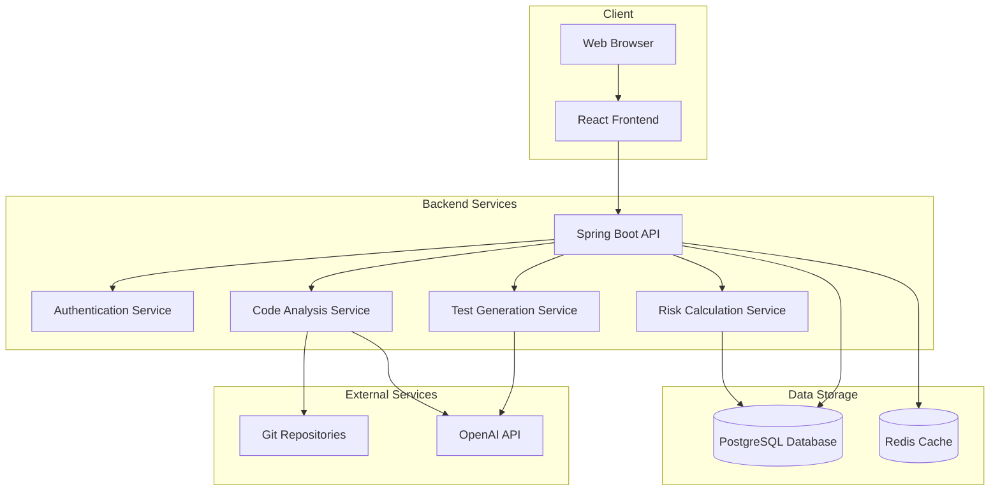
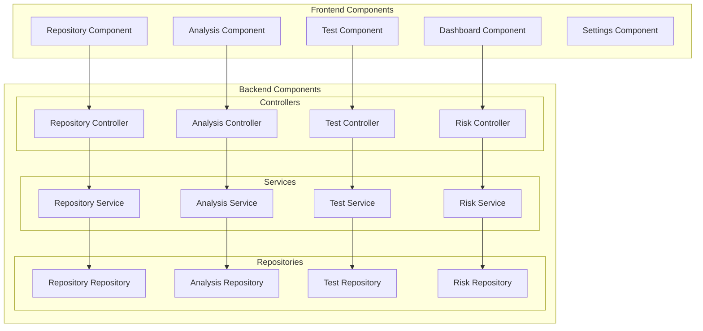
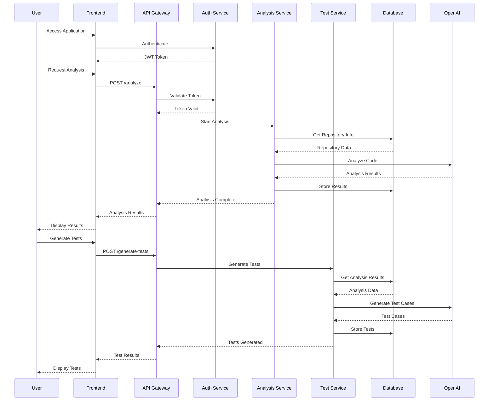
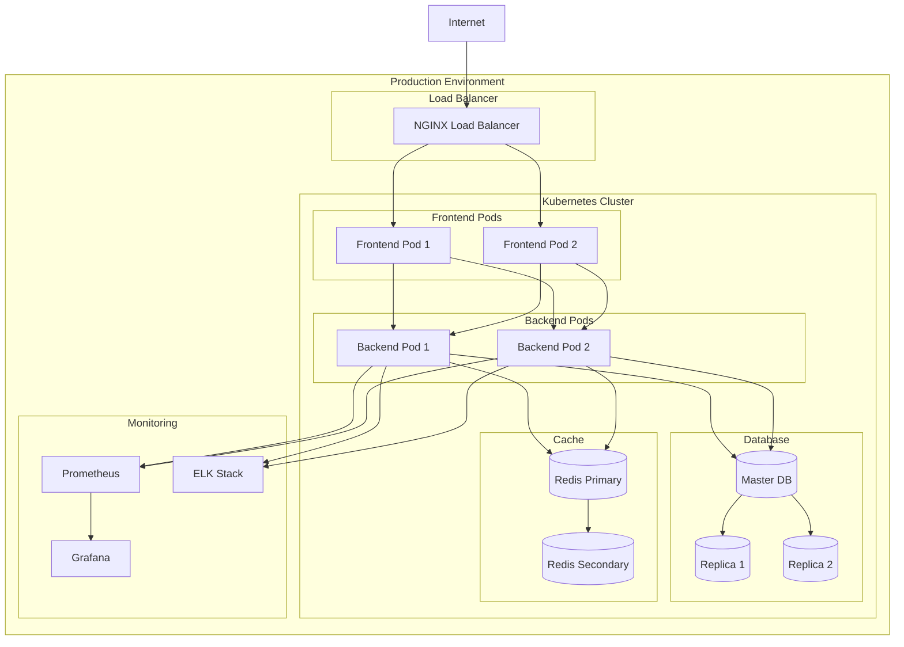
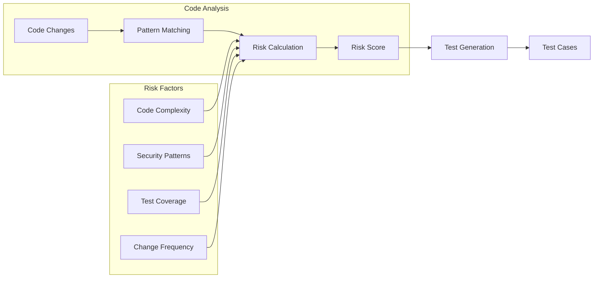
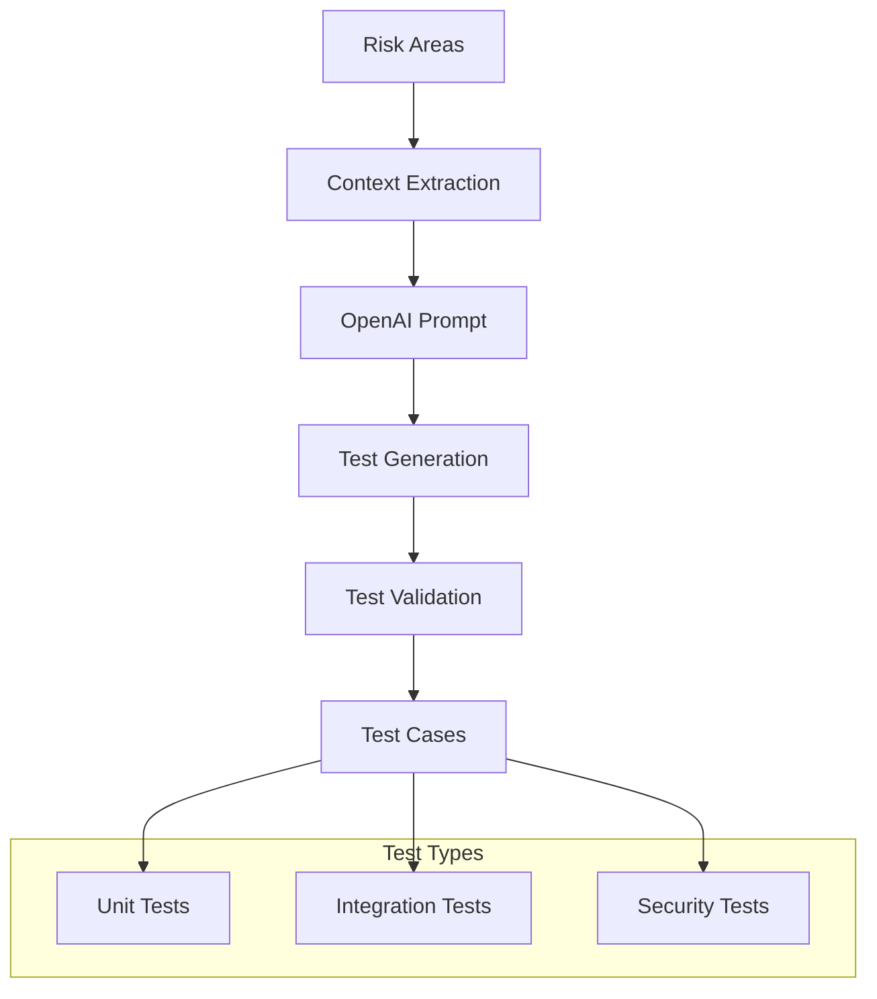
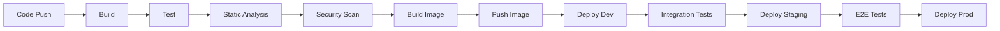

# TestSage System Diagrams

## High-Level Architecture

## Component Architecture

## Data Flow Diagram

## Deployment Architecture

## Risk Analysis Flow

## Test Generation Process

## CI/CD Pipeline

